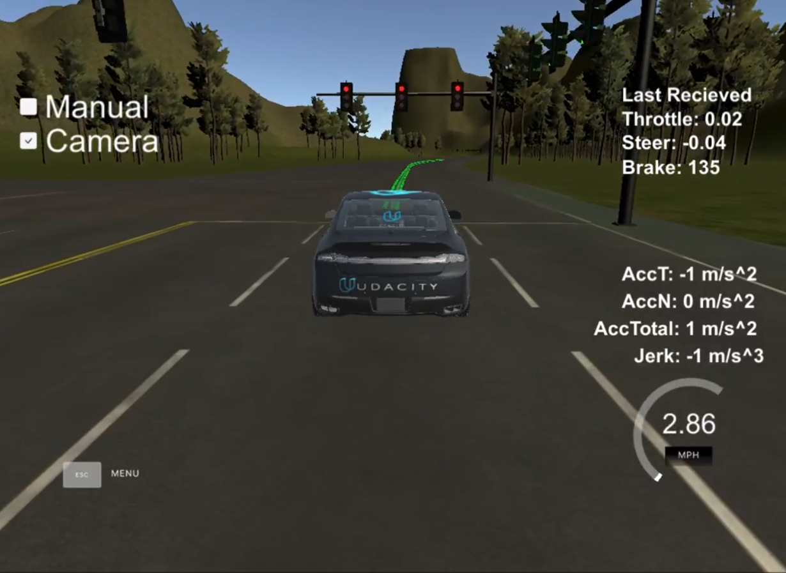

# Self_Driving_Car_Engineer_Nanodegree_Program

The Self-Driving Car Engineer Nanodegree program is an advanced program focusing on in-depth knowledge of autonomous systems. The program requires an application and is designed for those with moderate to high programming, technical, and/or quantitative skills.

## Final Result :

## Computer Vision, Deep Learning, and Sensor Fusion

In this term, you'll first apply computer vision and deep learning to automotive problems. You will teach the car to detect lane lines, predict steering angles, and more, all based on just camera data. Next, you'll learn sensor fusion, which you'll use to filter data from an array of sensors in order to perceive the environment.

## Computer Vision

Use a combination of cameras and software to find lane lines on difficult roads and to track vehicles.

## FINDING LANE LINES ON THE ROADADVANCED LANE FINDING
### Deep Learning
Deep learning has become the most important frontier in both machine learning and autonomous vehicle development. Experts from NVIDIA will teach you to build deep neural networks and train them with data from the real world and from the Udacity simulator. You’ll train convolutional neural networks to classify traffic signs, and then train a neural network to drive a vehicle in the simulator!

## TRAFFIC SIGN CLASSIFIERBEHAVIORAL CLONING
### Sensor Fusion
Tracking objects over time is a major challenge for understanding the environment surrounding a vehicle. Sensor fusion engineers from Mercedes-Benz will show you how to program fundamental mathematical tools called Kalman filters. These filters predict and determine with certainty the location of other vehicles on the road. You’ll even learn to do this with difficult-to-follow objects by using an extended Kalman filter, an advanced technique.

## Localization, Path Planning, Control, and System Integration

Work with a team to program Carla, Udacity’s real self-driving car! Learn to localize Carla by evaluating camera, radar, lidar, and GPS data to determine Carla’s precise location, and learn to plan where she should go and how the vehicle’s systems work together to get her there.

## Localization
Localization is how we determine where our vehicle is in the world. GPS is only accurate to within a few meters. We need single-digit centimeter-level accuracy! To achieve this, Mercedes-Benz engineers will demonstrate the principles of Markov localization to program a particle filter, which uses data and a map to determine the precise location of a vehicle.

## KIDNAPPED VEHICLE
### Planning
The Mercedes-Benz team will take you through the three stages of planning. First, you’ll apply model-driven and data-driven approaches to predict how other vehicles on the road will behave. Then you’ll construct a finite state machine to decide which of several maneuvers your own vehicle should undertake. Finally, you’ll generate a safe and comfortable trajectory to execute that maneuver.

## HIGHWAY DRIVING
### Control
Ultimately, a self-driving car is still a car, and we need to send steering, acceleration, and brake commands to move the car through the world. Uber ATG will walk you through building a proportional-integral-derivative (PID) controller to actuate the vehicle.

## PID CONTROLLER
### System Integration
This is the capstone of the entire Self-Driving Car Engineer Nanodegree Program! We’ll introduce Carla, the Udacity self-driving car, and the Robot Operating System that controls her. You’ll work with a team of Nanodegree students to combine what you’ve learned over the course of the entire Nanodegree Program to drive Carla, a real self-driving car, around the Udacity test track!
